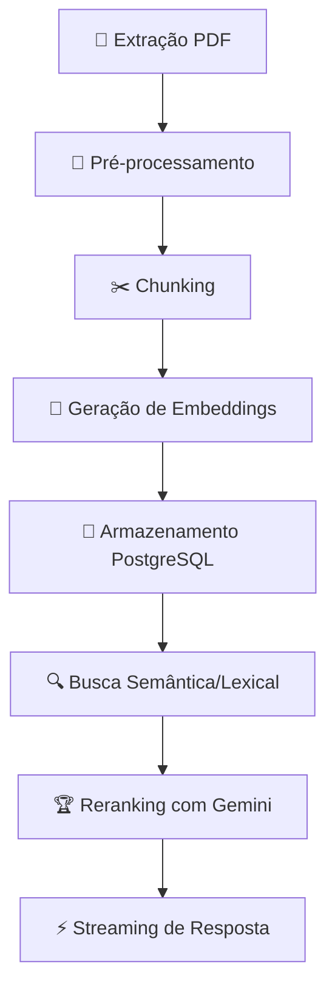

# 🧠💎 RAG Pipeline: Gemini, LangChain & PostgreSQL

Implementação de um pipeline completo de **Recuperação Aumentada por Geração (RAG)** utilizando a SDK do Gemini, LangChain e PostgreSQL com extensões vetoriais para busca semântica.

## 🛠️ Tecnologias Utilizadas

| Categoria | Tecnologias |
| :--- | :--- |
| **Linguagem** | Python 3.12 |
| **Banco de Dados** | PostgreSQL + pgvector + GIN |
| **LLM & Embeddings** | Google Gemini SDK (`google-genai`) |
| **Framework** | LangChain |
| **Processamento** | PyPDF, Asyncio, tiktoken |

## 📊 Fluxo do Pipeline RAG

## 🚀 Funcionalidades Principais

### 🔄 Processamento de Documentos
- **Extração textual** com PyPDF (página por página)
- **Limpeza e normalização** de conteúdo
- **Split inteligente**: chunks de 256 tokens com overlap de 64

### 🗄️ Armazenamento & Indexação
| Tipo de Indexação | Finalidade | Tecnologia |
| :--- | :--- | :--- |
| **IVFFLAT** | Busca semântica por similaridade | pgvector |
| **GIN** | Busca textual full-text | PostgreSQL |

### 🔍 Mecanismos de Busca
- **Semântica**: Similaridade de cosseno entre embeddings
- **Lexical**: Busca textual com GIN + tsvector/tsquery
- **Reranking**: Reordenamento inteligente via prompts do LangChain

### ⚡ Performance & UX
- **Token Streaming**: Respostas parciais em tempo real
- **Conexão keep-alive**: HTTP/1.1 sobre TCP para baixa latência
- **Processamento assíncrono**: Alta concorrência com asyncio

## 🏗️ Estrutura de Armazenamento

A tabela `tb_documents` armazena:
- `file_name` → Nome do arquivo origem
- `content` → Conteúdo do chunk textual  
- `tokens` → Contagem de tokens
- `embedding` → Vetor de embedding (pgvector)

## 🎯 Recursos Avançados

### 🤖 Integração Gemini
- Geração de embeddings vetoriais
- Reranking contextualizado
- Streaming de tokens com `agenerate_stream`
- Modelo `gemini-2.5-flash` para respostas

### 📊 Otimizações
- **Indexação dinâmica**: IVFFLAT recriado após novas ingestões
- **Pré-processamento**: Normalização textual para melhor qualidade de embeddings
- **Controle de tokens**: Gerenciamento preciso do contexto do prompt

